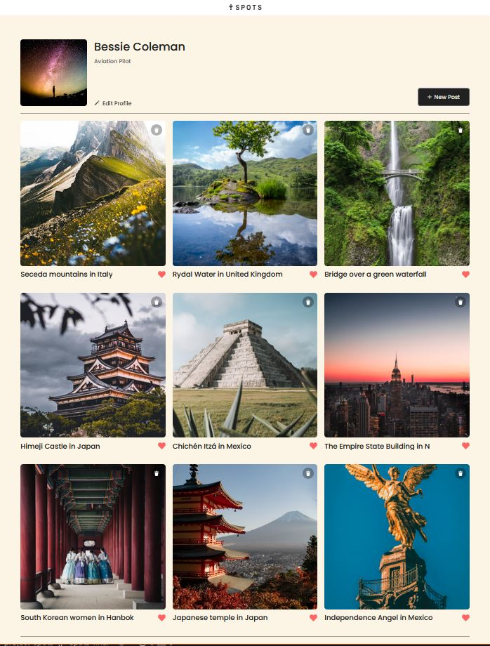
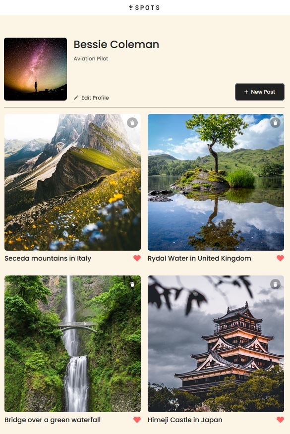
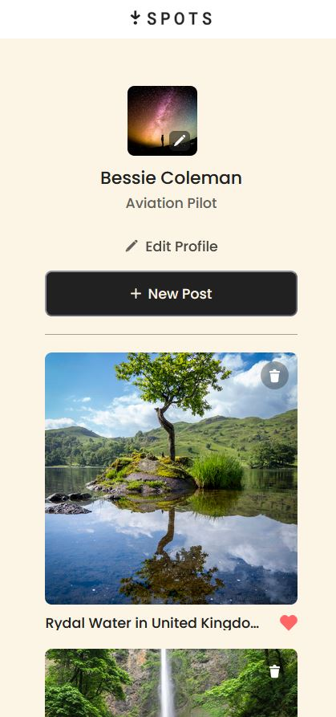

# Project 3: Spots

### Overview

- Intro
- Project links
- Project description
- Project features
- Figma
- Images
- Javascript Integration
- API integration
- Plan on improving project

**Intro**

This project aims to provide an interactive social media webpage called Spots, where users can add and remove location-based photos, interact with them by previewing images, liking/disliking or deleting them. Users can also make other adjustments to their profile, such as changing their avatars and profile name and description.

## Project links

Check out [this video](https://drive.google.com/file/d/1ZsAxmvOa-2l1gMontl-tbZ2myZZPQgLA/view?usp=sharing), where I describe my
project and some challenges I faced while building it.

Other links:

- [Github Page link to the project](https://ihekusmiles.github.io/se_project_spots/)
- [Video link to the project at an earlier stage](https://drive.google.com/file/d/1FTMmD2k7y3yyo10hzk2VYjBbEjS9-gdl/view?usp=sharing)

## Project description

This project is a social-media style web application where uses can share and interact with location based photo cards. This project serves as a transition from a static front-end to a dynamic, API-driven application. In terms of web development, some technologies used include HTML, CSS, JavaScript, flex, grid, NPM, and modules. This is the final stage of the project. All features can be tested in the GitHub Pages.

## Project features

- Semantic HTML5
- CSS
- Flexbox
- Grid
- Media Queries
- Responsive Design
- Ellipsis for long text
- JavaScript integration
- API integration
- Photo interactivity (eg. liking/deleting)
- Dynamic content-loading from server database via API calls
- Modal forms for adding new cards and editing profile information

**Figma**

In order to make the layout, Figma was used to extract all the necessary design details, eg. font sizes, styles, padding/margin distances etc. The link below:

- [Link to the project on Figma](https://www.figma.com/file/BBNm2bC3lj8QQMHlnqRsga/Sprint-3-Project-%E2%80%94-Spots?type=design&node-id=2%3A60&mode=design&t=afgNFybdorZO6cQo-1)

**Images**

The following screenshot shows what the page needs to look like at 1440px. All three columns must be displayed.

On a tablet between approximately 880px and 1320px there are two cards in each row like shown in the following screenshot:

At the smallest viewport, between 320px and 630px, the layout changes to a single card per row. Other elements such as font sizes/padding and margin distances as well as the profile button and profile avatar change in size accordingly:

**Javascript Integration**

Javascript is used in order to select elements and manipulate page behavior using Document Object Model (DOM) without touching HTML code. Furthermore, Javascript is used to close and open modals using functions and the Event Listener method.

## Plan on improving project

- Users should be able to edit the text description for each post. This is a functionality that could potentially be implemented into the project.
