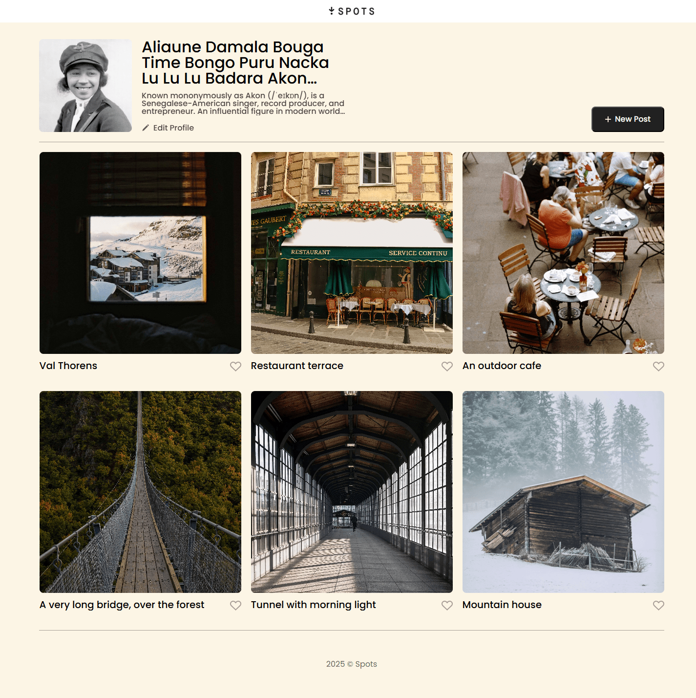

# Project 3: Spots

### Overview

- Intro
- Project description
- Project features
- Figma
- Images
- Plan on improving project

**Intro**

This project aims to provide an interative social media webpage called Spots, where users can add and remove photos, interact with them, and make minor adjustments to their profile.

## Project description

In this project, only the layout with hover effects are laid out. In terms of web development, the major focus of this project is to practice using various technologies such as CSS, HTML, flex, grid, and media queries in order to provide users a webpage that can be viewed on different screen sizes eg. desktop, tablet, and phone. The goal: Have all elements display correctly on popular screen sizes.

## Project features

- Semantic HTML5
- CSS
- Flexbox
- Grid
- Media Queries
- Responsive Design
- Ellipsis for long text

**Figma**

In order to make the layout, Figma was used to extract all the necessary design details, eg. font sizes, styles, padding/margin distances etc. The link below:

- [Link to the project on Figma](https://www.figma.com/file/BBNm2bC3lj8QQMHlnqRsga/Sprint-3-Project-%E2%80%94-Spots?type=design&node-id=2%3A60&mode=design&t=afgNFybdorZO6cQo-1)

**Images**

The following screenshot shows what the page needs to look like at 1440px. All three columns must be displayed.

On a tablet between approximately 880px and 1320px there are two cards in each row like shown in the following screenshot:

At the smallest viewport, between 320px and 630px, the layout changes to a single card per row. Other elements such as font sizes/padding and margin distances as well as the profile button and profile avatar change in size accordingly:

## Plan on improving project

- Add in the button functionality for the like button, edit button, and new post button.
